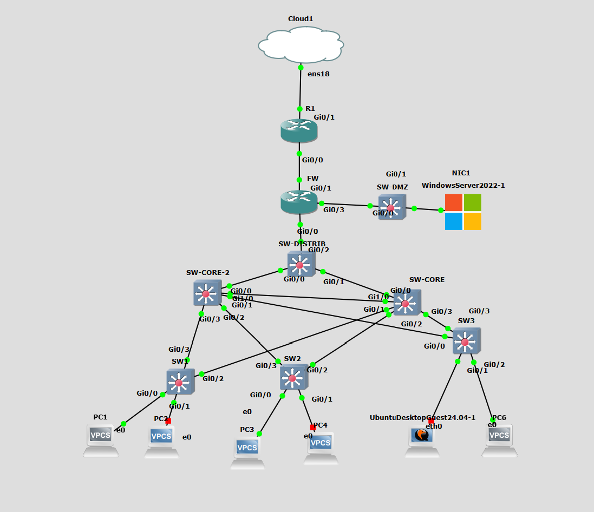

# Lab Réseau Complet — GNS3

Lab réseau monté en autonomie dans le cadre de ma préparation
à la certification CompTIA Network+ (N10-009).

## Architecture

## Équipements

| Équipement | Rôle | IP |
|---|---|---|
| R1 | Routeur WAN | 10.0.0.1 / DHCP WAN |
| FW | Firewall / Inter-VLAN | 10.0.0.2 / 192.168.0.1 |
| SW-CORE | Switch cœur | 192.168.0.2 |
| SW1/2/3 | Switches d'accès | — |
| Windows Server | DHCP + DNS | 192.168.0.10 |

## Ce qui est configuré

- VLANs 10, 20, 30 avec trunk 802.1Q
- Inter-VLAN routing via router-on-a-stick
- NAT/PAT pour accès internet
- DHCP relay vers Windows Server
- OSPF area 0 entre R1 et FW
- DMZ avec Windows Server 2022

## Technologies utilisées

- GNS3 sur Proxmox
- Cisco IOSv 15.9(3)M6
- Cisco IOSvL2 15.2.1
- Windows Server 2022

## Objectif

Préparation CompTIA Network+ N10-009